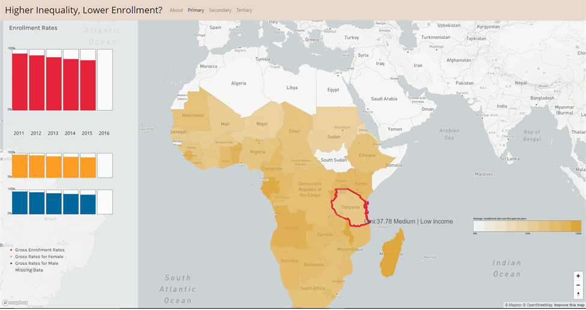

# Education and Inequality in Sub-Saharan African Countries
## Higher Inequality, Lower Enrollment?
### A Comparison of Enrollment Rates in Primary, Secondary and Tertiary Education across SSA Countries

#### Objectives
Education is one of the major factors that contribute to the inequalities in Sub-Saharan Africa. With the improvements in primary education, educational enrollment in general is still having a lot of issues.
This visualizaion aims to provide a broad perspective to investigate enrollment situations across different regions in SSA as well as specific changes in the past few years within each country. 

#### Special Focus 
Gender inequality is another major concern in education. I am bringing an extra perspective to compare the 
differences in enrollment rates from both male and female.

#### Data Source
World Bank 2016
